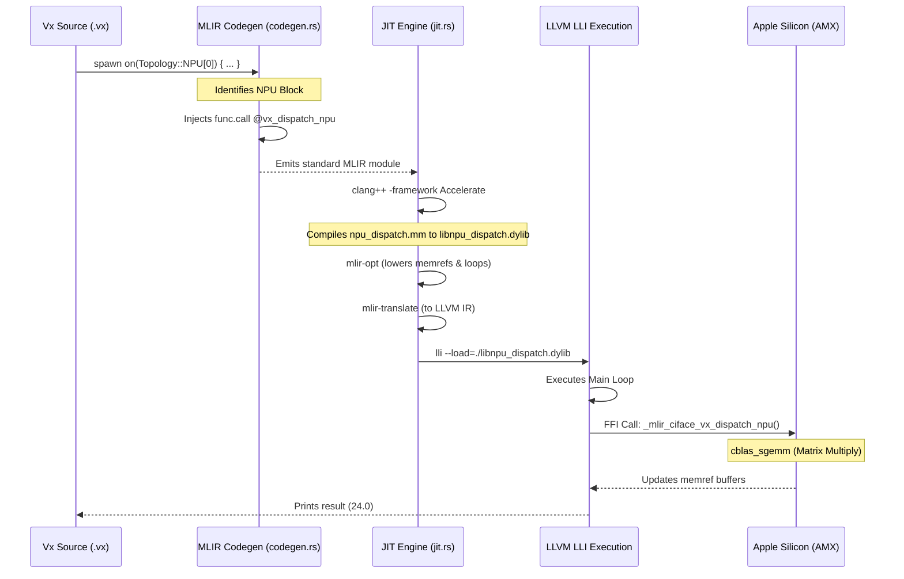

# NPU Hardware Dispatch Architecture

This document details the exact process of how the Vx compiler intercepts `Topology::NPU` memory boundaries and dynamically offloads computations to Apple Silicon hardware directly from the JIT compilation engine.

## Architectural Overview

A key goal of Vx is to simulate and program heterogeneous execution environments (CPUs, GPUs, NPUs, etc.) directly as first-class citizens using topologies. To simulate actual hardware acceleration on Mac systems, the Vx compiler avoids Python or slow remote calls. Instead, it utilizes an Objective-C++ dispatcher that triggers the Apple Matrix Coprocessor (AMX) directly through the macOS Accelerate framework.

Here is the entire flow of the compilation and execution pipeline:



## Step 1: AST Interception (`codegen.rs`)

During MLIR generation, when the compiler visits a `Statement::SpawnOn` block, it checks the topology.

If it detects `Topology::NPU(_)`, it analyzes the environment for the required parameters (in our simulated case: `a`, `b`, and `result` tensors). Instead of emitting nested `scf.for` loops in MLIR, it completely replaces the computational block with an external FFI call to the dispatcher:

```mlir
%success = func.call @vx_dispatch_npu(%a, %b, %result) : (memref<?x?xf32>, memref<?x?xf32>, memref<?x?xf32>) -> i1
```

Crucially, the function signature is declared with `attributes { llvm.emit_c_interface }`. This prevents MLIR from unrolling the `memref` struct into 7 separate arguments, and instead wraps them in C-compatible pointers.

## Step 2: Objective-C++ Runtime (`npu_dispatch.mm`)

The external call requires a concrete C function. We define this in an Objective-C++ file `runtime/npu_dispatch.mm`. Because of the `llvm.emit_c_interface` attribute, the function signature must strictly follow MLIR's C ABI convention (`_mlir_ciface_<name>`):

```cpp
extern "C" bool _mlir_ciface_vx_dispatch_npu(MemRef2D* input_a, MemRef2D* input_b, MemRef2D* output_ref)
```

Inside this function, we extract the matrix dimensions from the `MemRef2D` structs (e.g., `input_a->sizes[0]`) and invoke `cblas_sgemm` from Apple's `Accelerate` framework. This explicitly offloads the floating-point matrix multiplication to the dedicated hardware matrix coprocessor.

## Step 3: JIT Orchestration (`jit.rs`)

To tie the MLIR FFI call and the C++ runtime together dynamically, the `JitEngine` intercepts the compilation pipeline. When running on macOS, it dynamically shells out to `clang++` to compile `npu_dispatch.mm` into a dynamically linked library:

```bash
clang++ -shared -fPIC -fobjc-arc -O3 runtime/npu_dispatch.mm -framework Accelerate -framework Foundation -o libnpu_dispatch.dylib
```

It then feeds the `libnpu_dispatch.dylib` directly into LLVM's execution engine via the `--load` flag:

```bash
lli --load=./libvx_rt.dylib --load=./libnpu_dispatch.dylib temp.ll
```

## Step 4: Unified Memory Architecture (UMA) & Zero-Copy Execution

In a traditional discrete GPU environment (e.g., an Nvidia card connected via PCIe), the memory architectures of the Host CPU and the Accelerator are physically separated. In such a scenario, the compiler would need to inject explicit `cudaMemcpy` operations to transfer `HostDRAM` data to the `NPU_HBM` before the `spawn on` block, and back again to print the result.

However, Apple Silicon utilizes a **Unified Memory Architecture (UMA)**, meaning the CPU and the AMX share the exact same physical RAM. Our implementation takes full advantage of this to achieve **true zero-copy execution**.

Consider this snippet from `tests/backend/pass/ane_matmul.vx`:

```rust
// 1. Memory allocated in standard RAM
let mut result = Tensor([4, 4]).with_memory(Memory::NPU_HBM);

// 2. Execution dynamically offloaded to AMX
spawn on(Topology::NPU[0]) {
  for i in 0..4 {
    for j in 0..4 {
      for k in 0..4 {
        result[i][j] += a[i][k] * b[k][j];
      }
    }
  }
}

// 3. CPU reads the updated memory in-place!
print(result);
```

Behind the scenes:
1. When `result` is initialized, MLIR allocates standard host RAM via its `memref` type.
2. During the `spawn on` block, our FFI wrapper passes the raw `float*` pointers of those memory references directly to the Apple Matrix Coprocessor.
3. The AMX reads the inputs and writes the result *in-place* to the original `memref` pointer without any PCIe bus transfers.
4. When `print(result)` is called, the Host CPU simply reads that exact same memory location, which now holds the hardware-computed matrix data!

## Summary

This architecture gives Vx a **zero-overhead FFI** into native machine code. It successfully simulates disaggregated, heterogeneous hardware by replacing AST blocks with dynamic JIT-loaded native libraries that talk directly to silicon, seamlessly modeling zero-copy shared memory systems.
